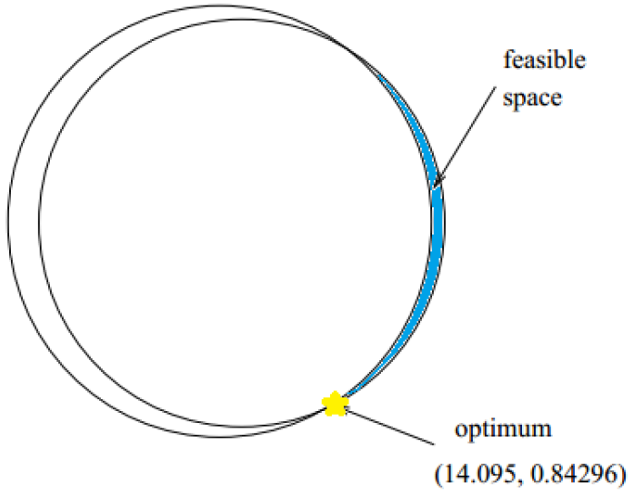
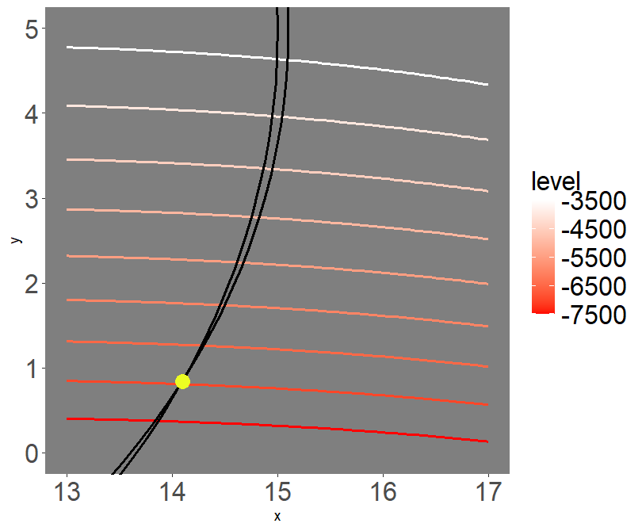

# SACOBRA
Self-adjusting constrained optimization in R.

SACOBRA is a package for numerical **constrained optimization** of expensive black-box functions under **severely limited budgets**. The problem to solve is: 
```math 
\mbox{Minimize}\quad  f(\vec{x}) , \vec{x} \in [\vec{a},\vec{b}] \subset \mathbf{R}^d 
```
$$ \mbox{subject to}\quad g_i(\vec{x}) \le 0, i=1,\ldots,m    $$
$$ \mbox{~~~~~~~~~~}\quad\quad h_j(\vec{x}) = 0, j=1,\ldots,r.    $$

SACOBRA performs optimization with a minimum of true function evaluations. It has proven to work well on problems with high dimensions (e.g. $d=124$) and many constraints (e.g. $m+r=60$). It is usable for all kind of **numerical** optimization of continuous functions, but not for combinatorial optimization or discrete optimization.

SACOBRA can be used for unconstrained optimization problems as well, but its focus is on constrained optimization. Other packages might be more suitable for unconstrained optimization.

< SACOBRA logo >

## Installation

To install from GitHub:
```
install.packages("devtools")    # if not yet installed

require(devtools)
install_github("WolfgangKonen/SACOBRA", dependencies = NA)
```

or download / clone this GitHub repo and use the tools in RStudio for building and installing packages.

## Usage
How to set up a constrained optimization problem? - Define a function `fn` that accepts a $d$-dimensional vector $\vec{x}$ and returns an $(1+m+r)$-dimensional
vector $(f,g_1,\ldots,g_m,h_1,\ldots,h_r)$.

How to code which constraint is equality constraint? - Function `fn` should return 
an $(1+m+r)$-dimensional vector with named elements. The first element is the objective, the 
other elements are the constraints. All equality constraints should carry the name `equ`. 
(Yes, it _is_ possible that multiple elements of a vector have the same name.) 
                     
More detailed information with
```
help("SACOBRA")
```


## Examples
Several package methods contain examples that can be run with the following commands:
```
example(cobraInit)      # onCircle, a problem with equality constraint
example(cobraPhaseII)   # unconstrained sphere problem
example(COP)            # load and solve G24, load and solve the scalable problem G03 with d=3
example(multiCOBRA)     # solve G11 problem nrun=4 times
example(startCobra)     # solve a 13d-problem with 9 inequality constraints (G01)
```

### Example *onCircle*
```
example(cobraInit)     
```
The problem to solve is the sphere function `sum(x^2)` with the equality constraint that the solution is on a circle with radius 2 and center at c(1,0).
```
d=2
fn=function(x){c(obj=sum(x^2),equ=(x[1]-1)^2+(x[2]-0)^2-4)}
cobra <- cobraInit(xStart=rep(5,d), fn, fName="onCircle",  
                   lower=rep(-10,d), upper=rep(10,d), feval=40)
```

Run cobra optimizer:
```
cobra <- cobraPhaseII(cobra)
```

The true solution is at `solu = c(-1,0)` (the point on the circle closest to the origin)
where the true optimum is `fn(solu)[1] = 1`
The solution found by SACOBRA is pretty close to this:
```
print(getXbest(cobra))    # -9.999958e-01 -1.905111e-06
print(getFbest(cobra))    # 0.9999916
```


### Example *G06* 
<table>
  <tr>
    <td border=0></td>
    <td></td>
  </tr>
</table>


< an example with a nice image>


